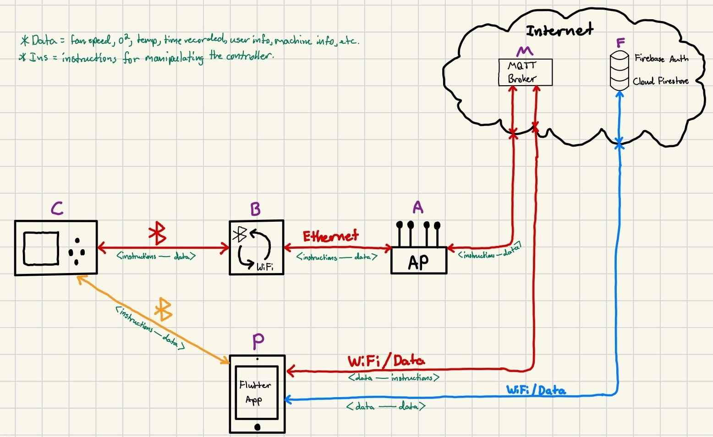
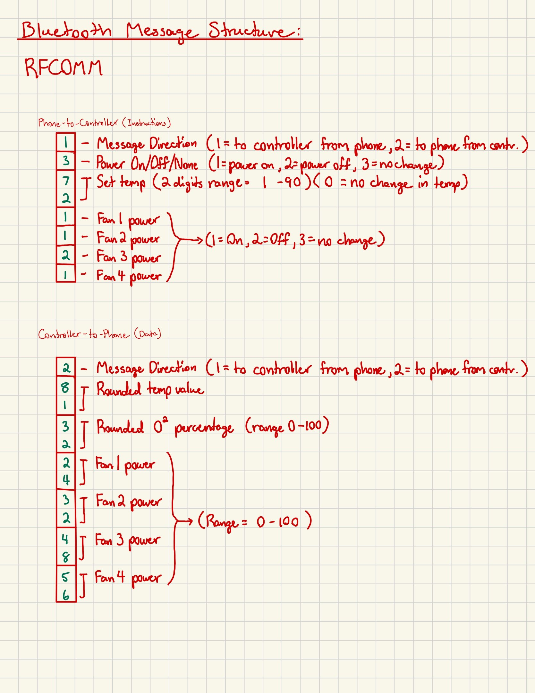
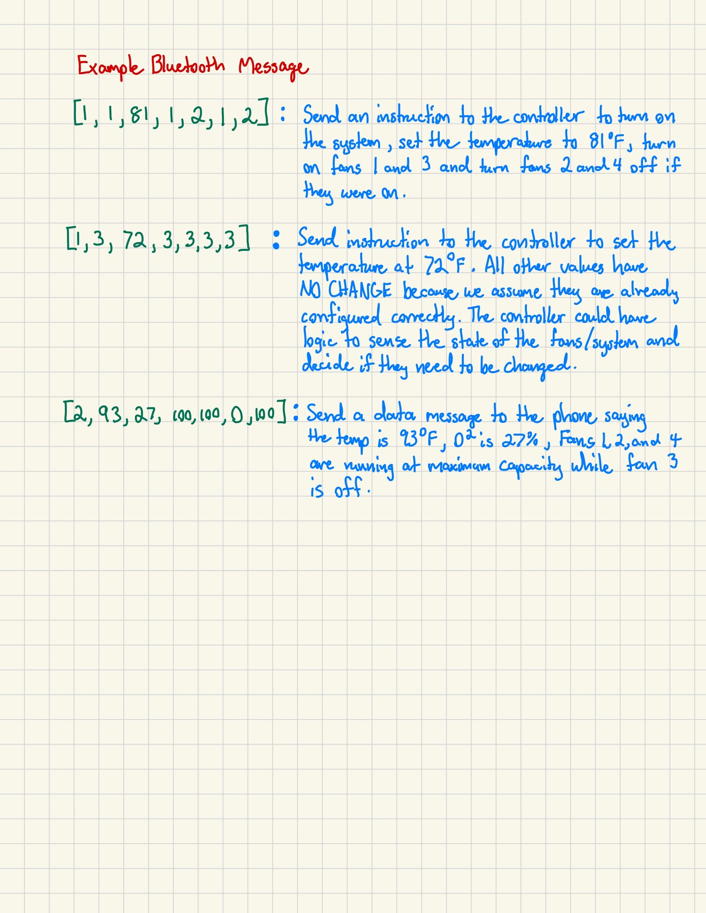

# Crimson Furnace (Smart Remote App)

## Introduction
This project is an app to connect to a wood burning stove. This app will be able to control the thermostat of the stove. It will also be able to read and display some values collected by the furnace. The app will be able to connect to the furnace through the internet, allowing control and data collection to happen remotely. The technical implementation of this, as well as instructions for using these APIs, will be discussed in this document. We will also discuss the layout of the code, the libraries we used, and usernames and passwords for accessing any of these features. In addition to this, some tips for how to scale the functionality of this project to either include better functionality or to work for more devices will be included. This documentation contains everything that is needed to understand and use the Crimson Furnace system.

---

## Table of Contents
1. [Introduction](#introduction)
2. [Overview](#overview)
3. [Flutter App Code](#flutter-app-code)
4. [Bridge Device Configuration and Code](#bridge-device-configuration-and-code)
4. [MQTT Configuration](#mqtt-configuration)
5. [Firebase Configuration](#firebase-configuration)
6. [Credentials](#credentials)
7. [Tips for Scaling](#tips-for-scaling)
7. [Links to Resources](#links-to-resources)
8. [Project Website](#project-website)

---

## Overview
This project was developed by Wesley Junkins, Dylan Iovino, Sammy Geraci, and Zack Bowling.
The overall system design follows the structure of the diagram below:

The controller (C), is connected to the furnace. It is responsible for reading values from the sensors and controlling the fan speeds. It is capable of communicating through Bluetooth. The bridge (B) is responsible for bridging communication between WiFi and Bluetooth, connecting the controller to the internet. The access point (A), connects this portion of the system to the internet. The MQTT broker (M) handles the passing of messages between different devices over the internet. The Firebase system (F), handles long-term data storage as well as user authentication. The phone app (P), is able to connect to the controller over the internet via MQTT. It can also connect to the firebase database and authentication server for authentication and data storage/reading.

The messages are passed as arrays between the phone and the controller. The diagram below helps visualize the structure of the messages.

Each message is structured as an array of 7 integers. There are two general structures of the arrays: phone-to-controller instructions, and controller-to-phone data.
For phone-to-controller instructions, the array contains the values that the controller should set. Each possible value for each array index is listed in the above diagram.
For the controller-to-phone data, the array only consists of sensor data collected from the controller.
The first index of the array specifies the direction of the message.

The flutter app collects the data arrays from the MQTT broker and displays it to the graph. It also has the functionality to read from the database and display the information that way.

---

## Flutter App Code
The flutter app code has its own documentation which is inside the project repository. Below is a brief overview of the functions of the code.

The flutter app runs on iPhone and Android, and is programmed using the Flutter framework in the Dart programming language.
The app's main function is to connect to a furnace to read and display data, as well as provide an interface for the user to remotely control the furnace from the phone.

Upon opening, a login page will be displayed. Logging in shows the main page, which consists of the current temp value, the current temp-set value, and the fan indicators. The bottom bar has additional pages. These can also be extended to include added functionality later. The top menu list has functionality to log out, access settings (not implemented yet), and room for extra items.

## Bridge Device Configuration and Code
The bridge device is simply a Raspberry Pi 5 running a custom-built program to take input from either WiFi or Bluetooth and convert it into the opposite format.

The documentation for the bridge code is in the repository for the pi_bridge. A general overview of the code is below.

The raspberry pi, upon running the code, will act as a server and will run indefinitely listening for both bluetooth and MQTT messages. Once it receives a message, it determines where that message should go. If the message came from the controller, it is considered DATA and will be published to the MQTT sensordata topic and will be written to the Firebase database. If the message was sent from the phone to the controller, it is considered INSTRUCTIONS and will be sent to the controller through bluetooth. 

The bridge code should not be changed in any way. The raspberry pi will be configured to run this program immediately after startup. The Pi will handle arrays of 7 integers ONLY. Anything else will cause an error. The only configuration needed for the raspberry pi bridge code is to change the global_machine_used variable to match the machine name of the machine you are currently using. 

### Example Controller Code
The pi_bridge repository also contains a controller_example program. This program also has its own documentation inside the documentation for the bridge. This is a Python program that is supposed to mimic the functionality of the controller. It simply sends and receives arrays. Any controller program must know the bluetooth MAC address for the raspberry pi. To find the bluetooth MAC address, turn on bluetooth on the Pi. Then open a terminal and type "hciconfig". The value "BD Address" is the bluetooth MAC address. The MAC address is hardware specific, so it will need to be reconfigured only when you change run the program on a different Pi.

To use the example code, the bridge program must be running on the raspberry pi. Then, run the controller program on a laptop that has bluetooth enabled. It should pair automatically if the MAC address of the raspberry pi is given correctly. Then, arrays will be exchanged. The structure of those arrays must remain the same, but the contents of the arrays can be manipulated by the controller.

## MQTT Configuration
In this project, MQTT is used as the message passing service that runs over the internet. In the overview, the MQTT broker is a server, ours is provided by HiveMQ. The broker manages different "topics." Clients publish messages to topics and other clients subscribe to the topics to receive those messages.

The MQTT broker used is HiveMQ. The broker has a broker address that must be used to publish or subscribe to any topic on the broker. In addition, each client has a username and password, which must be set in the MQTT console. For testing, two accounts were created:

    MQTT Stove Client
    -crimsonfurnace1
    -Burnbabyburn1

    MQTT Phone Client
    -testapp1
    -Burnbabyburn1

The port used in all communications for this project is port 8883. 

There are limits on the number of messages and clients that can use the MQTT broker. If this limit is reached, simply recreate an MQTT cluster. A video on how to do this will be linked in the resources section.

## Firebase Configuration
Firebase is a multipurpose online tool that allows for authentication and database storage. For the Furnace system, we use both authentication and database storage (cloud firestore).

### Cloud Firestore
Firebase was used to store the data collected from the controller. The structure of the database is as follows:

    - machines: a collection of all the machines in the system. Each machine is denoted by a random ID. Each machine has a few fields: Active status, Time of last update, and the name of the machine.

    - Sensor Data: each machine has a collection that stores the sensor values taken from the controller. Each document in this collection corresponds to a data snapshot. It has a temperature reading, an oxygen level reading, and the timestamp that the data was collected.

    - users: another collection (alongside machines) that stores the first and last names of users. Each document in this collection corresponds to a person, including a first and last name, as well as an array linking to each machine that person owns. The machine link links to the machines collection.

### Authentication
Firebase was also used for authentication. The Firebase console contains sections for Firestore and authentication. The authentication tab simply shows the emails and information of those who have added themselves to the app. This is the email and password they will enter to get into the app. If their email/password does not match what is in the database, they will not be allowed to access the app. To add users to the app, you need to manually add them to the firebase authentication using the console.

## Credentials
To access each of the tools used in this project, you'll need the correct credentials.

First, an email has been created to be used for all of these tools:

    General Email
    Email: crimsonfurnace@yahoo.com
    Password: burnbabyburn

Next, HiveMQ requires a login:

    HiveMQ Broker
    Email: crimsonfurnace@yahoo.com
    Password: BurnBabyBurn123

In HiveMQ, there are a couple of example credentials already created. Creating more is simple using the HiveMQ console. There is one credential for the app client and one for the raspberry pi client. Both of these devices must have an MQTT client in order to communicate with the broker.

    HiveMQ Pi Client
    Username: crimsonfurnace1
    Password: Burnbabyburn1

    HiveMQ App Client
    Username: testapp1
    Password: Burnbabyburn1

## Tips for Scaling
This system contains the foundational backbone for a much broader system. There are multiple ways to scale. A few tips are below:

    - Have a centralized system to assign unique IDs to each machine and track them.

    - Build the functionality to associate a machine with a user ID in Firestore.

    - Build an interface for users to register and automatically add a new machine to the database as well as sign themselves up to gain access to the app.

    - Embed both WiFi and Bluetooth capabilities with each machine, instead of using a bluetooth-wifi bridge to manage conversions.

    - Make an interface to manage the bluetooth-wifi bridge. I.e. have an interface that allows manipulation of the location to send and receive data.

    - To implement the controller into this system, look at the controller_example code in the pi_bridge repository. Convert this code to something that will run on the Pic24 controller and edit the code to fit any specific use cases.

## Links to Resources

    HiveMQ Console: https://console.hivemq.cloud/

    Firebase Console: https://console.firebase.google.com/project/ua-smart-remote/overview

    Project Repository: https://github.com/WesleyJunkins/smart-remote.git

    Bridge Repository: https://github.com/WesleyJunkins/pi_bridge.git

    Flutter Documentation: https://docs.flutter.dev/

    MQTT Documentation: https://mqtt.org/

    HiveMQ Documentation: https://docs.hivemq.com/hivemq/latest/user-guide/index.html

    Firebase General Documentation: https://firebase.google.com/docs

    Firebase Cloud Firestore Docmentation: https://firebase.google.com/docs/firestore

    Firebase Authentication Documentation: https://firebase.google.com/docs/auth

## Project Website
Find our project website here: https://github.com/WesleyJunkins/UA_smart_remote_website

This website includes a video that provides a general overview of the project and explains how to use the system we created.

This locations and URLs in this document will be finalized once the handoff to the client is complete.
